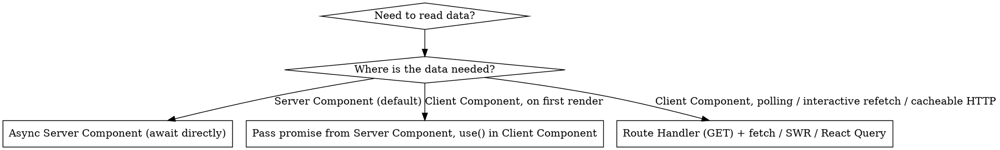

# Next.js 16 Data Fetching — Server Components, not Server Actions in useEffect

## Scope — Next.js 16 App Router only

This skill applies **only to Next.js 16 App Router projects**. Before applying any rule below, confirm the target codebase actually is one:

- `package.json` has `"next": "^16…"` (or a 16.x range / git ref resolving to 16) **and**
- routes live under `app/` (App Router), not `pages/` (Pages Router).

**If the project is anything else, refuse to apply this skill** and say so explicitly:

- Pages Router (`pages/` directory) — different mental model: `getServerSideProps` / `getStaticProps` / API routes / SWR. The Server Component / Server Action / `revalidatePath` machinery does not exist there. Do not apply.
- Next.js 15 or earlier — APIs and defaults differ; `searchParams` is sync, `refresh()` is not in `next/cache`, cache semantics changed. Do not apply.
- Any other framework (Remix, SvelteKit, Astro, Vite + React, RedwoodJS, plain React, etc.) — the entire premise (RSC + Server Actions) doesn't transfer. Do not apply.
- Mixed monorepo where some apps are 16/App-Router and some aren't — apply only inside the matching app directory.

State the mismatch plainly ("This file is in `pages/`, so the `nextjs-data-fetching` skill doesn't apply — Pages Router uses different primitives") and stop. Don't translate the patterns to a foreign framework.

## Companion skill — install and follow `no-use-effect`

This skill **never recommends `useEffect`**. Every code path here either avoids it entirely or routes through the project's `useMountEffect` helper. If you don't already have it, install the `no-use-effect` skill alongside this one — it owns the broader React-side rule (derive state, use a query library, use event handlers, use `key` to reset, use `useMountEffect` for one-time external sync) and it owns the lint rule (`no-restricted-syntax` banning bare `useEffect`).

If you find a green example below that *looks* like it would have been a `useEffect` in older code, that's the point — it isn't one anymore. The `❌` red blocks below show `useEffect` only because that's what the anti-pattern actually looks like in the wild; never copy from a red block.

## The Rule

**Read data in Server Components. Mutate data with Server Actions. Never use `useEffect` (or `useState + useEffect`) in a Client Component to call a Server Action just to load data.**

This applies to every Next.js 16 App Router project, including `apps/manager/`. Violating it costs streaming, caching, request deduping, and turns one render into a sequential client-side waterfall.

**Violating the letter of this rule is violating the spirit.** The framework lets you call a `"use server"` function from a Client Component — that's a capability, not a license. The signal that you've drifted is not a runtime error (there is none), it's the patterns below: a `getX` action, a `useEffect` that fetches, a page newly converted to `"use client"`. **The bug is silent: no error, no warning, just worse UX, wasted POSTs, no streaming, no cache.** The absence of a stack trace is not the absence of a problem.

## Why

Per the official Next.js docs:

> "Server Functions are designed for server-side **mutations**, and the client currently dispatches and awaits them **one at a time**. […] If you need parallel data fetching, use data fetching in Server Components."
> — `docs/01-app/01-getting-started/07-mutating-data.mdx`

> "Server Actions are queued, and using them for data fetching introduces sequential execution."
> — `docs/01-app/02-guides/backend-for-frontend.mdx`

Concretely, a `useEffect`-driven Server Action read costs you:

- **No SSR** — the page paints empty, then fetches after hydration. Worst LCP.
- **Sequential queue** — every Server Action call waits on the previous one. No parallelism.
- **No request deduping / caching** — Server Actions always POST; React's request cache, `fetch` cache, and `unstable_cache` don't apply.
- **No streaming** — you can't progressively render with `<Suspense>`.
- **Double-fetch on mount** in Strict Mode dev.
- **Larger client bundle** — fetch logic, loading states, error states all ship to the browser.

## Decision: how to load data



**Server Actions are for mutations only.** The only legitimate "action call from a button" that returns data is a follow-up to a user-initiated mutation (e.g., a form submission that returns the new record).

## The four correct patterns

### 1. Async Server Component — the default

```tsx
// app/(platform)/cases/page.tsx
import { listCases } from "@/lib/services/case.service";

export default async function CasesPage() {
  const cases = await listCases();
  return <CasesTable cases={cases} />;
}
```

Use this whenever the data is needed for the initial render. No `"use client"`, no `useEffect`, no Server Action.

### 2. Stream a promise to a Client Component with `use()` + `<Suspense>`

When a Client Component (because of interactivity) needs server-fetched data on first render:

```tsx
// app/(platform)/cases/page.tsx — Server Component
import { Suspense } from "react";
import { listCases } from "@/lib/services/case.service";
import CasesTable from "./cases-table"; // Client Component

export default function CasesPage() {
  const casesPromise = listCases(); // do NOT await

  return (
    <Suspense fallback={<CasesTableSkeleton />}>
      <CasesTable casesPromise={casesPromise} />
    </Suspense>
  );
}
```

```tsx
// cases-table.tsx
"use client";
import { use } from "react";
import type { Case } from "@hive/types";

export default function CasesTable({
  casesPromise,
}: {
  casesPromise: Promise<Case[]>;
}) {
  const cases = use(casesPromise); // suspends until resolved
  // …interactive UI
}
```

The Server Component starts the fetch, streams HTML as soon as it can, and the Client Component hydrates with the resolved value. No client-side waterfall.

### 3. Route Handler for cacheable / pollable / mutating-from-third-party reads

If a Client Component truly needs to refetch on a timer, on focus, or via SWR/React Query keys, expose a `GET` Route Handler and fetch it normally:

```ts
// app/api/cases/route.ts
import { NextResponse } from "next/server";
import { listCases } from "@/lib/services/case.service";

export async function GET() {
  const cases = await listCases();
  return NextResponse.json(cases);
}
```

Route Handlers are real HTTP — cacheable, parallelizable, and compatible with SWR/React Query. Server Actions are not.

### 4. Server Action — only for mutations, invoked via `<form>` or event handler after user intent

```tsx
"use server";
export async function archiveCase(id: string) {
  await db.update(cases).set({ archivedAt: new Date() }).where(eq(cases.id, id));
  revalidatePath("/cases");
}
```

After the mutation, call `revalidatePath` / `revalidateTag` and let the Server Component re-render with fresh data. Don't return a list to refresh client state by hand.

## Anti-pattern catalog — red ❌ → green ✅

Each pair is verified against the Next.js 16 App Router docs. Sources cited inline.

### 1. Reading data via a Server Action in `useEffect`

❌ **Red — sequential POST queue, no SSR, no streaming, no cache, double-fetch in dev Strict Mode:**

```tsx
"use client";
import { useEffect, useState } from "react";
import { getCases } from "@/lib/actions/cases.actions"; // "use server"

export default function CasesPage() {
  const [cases, setCases] = useState<Case[]>([]);
  useEffect(() => {
    getCases().then(setCases);
  }, []);
  return <CasesTable cases={cases} />;
}
```

✅ **Green — async Server Component, fetch on the server, stream HTML:**

```tsx
// app/(platform)/cases/page.tsx
import { listCases } from "@/lib/services/case.service";

export default async function CasesPage() {
  const cases = await listCases();
  return <CasesTable cases={cases} />;
}
```

> *"Server Functions are designed for server-side **mutations**, and the client currently dispatches and awaits them **one at a time**. […] If you need parallel data fetching, use data fetching in Server Components."* — `docs/01-app/01-getting-started/07-mutating-data.mdx`

**No `useEffect` — ever.** Even the rare "fire a mutation on mount" case (e.g., a view counter that calls a Server Action when the page loads) does **not** use `useEffect` here. Per the `no-use-effect` skill, that's `useMountEffect` — the project's escape-hatch helper that wraps `useEffect(fn, [])` with explicit intent and a single eslint-disable in one place:

```tsx
"use client";
import { useMountEffect } from "@/lib/hooks/use-mount-effect";
import { incrementViews } from "@/lib/actions/views.actions"; // "use server" — a real mutation

export function ViewCounter() {
  useMountEffect(() => {
    incrementViews();
  });
  return null;
}
```

Even with `useMountEffect`, ask first: does this need to run on the client at all? A view increment can usually run inside the page Server Component (no client component, no hook). Reach for `useMountEffect` only when you genuinely need a browser-side trigger (DOM API, third-party widget, focus management).

---

### 2. Filter / tab / range state in `useState`, refetched via Server Action

❌ **Red — page becomes a Client Component to host the filter state; every chip click hits a queued POST:**

```tsx
"use client";
import { useEffect, useState } from "react";
import { getCases } from "@/lib/actions/cases.actions";

export default function CasesPage() {
  const [status, setStatus] = useState<"open" | "closed">("open");
  const [cases, setCases] = useState<Case[]>([]);
  useEffect(() => {
    getCases({ status }).then(setCases);
  }, [status]);
  return /* filters + table */;
}
```

✅ **Green — filter state lives in the URL `searchParams`; the Server Component re-renders with fresh data; the URL is shareable and the back button works:**

```tsx
// app/(platform)/cases/page.tsx — Server Component
import { listCases } from "@/lib/services/case.service";
import { CasesFilters } from "./cases-filters";

export default async function CasesPage({
  searchParams,
}: {
  searchParams: Promise<{ status?: string }>;
}) {
  const { status = "open" } = await searchParams;
  const cases = await listCases({ status });
  return (
    <>
      <CasesFilters value={status} />
      <CasesTable cases={cases} />
    </>
  );
}
```

```tsx
// cases-filters.tsx — small Client Component, pushes to URL
"use client";
import { usePathname, useRouter, useSearchParams } from "next/navigation";

export function CasesFilters({ value }: { value: string }) {
  const router = useRouter();
  const pathname = usePathname();
  const sp = useSearchParams();
  const set = (status: string) => {
    const next = new URLSearchParams(sp);
    next.set("status", status);
    router.replace(`${pathname}?${next}`, { scroll: false });
  };
  return /* chips that call set(...) */;
}
```

> Server Components receive `searchParams` as an async prop; changing the URL re-runs the Server Component on the server. — `docs/01-app/01-getting-started/06-fetching-data.mdx` (page params/searchParams).

---

### 3. Manually re-running a read after a mutation

❌ **Red — reach for `setState` after every mutation, ship list-management code to the client:**

```tsx
"use client";
import { listCases, deleteCase } from "@/lib/actions/cases.actions";

export function CasesList() {
  const [cases, setCases] = useState<Case[]>([]);
  useEffect(() => { listCases().then(setCases); }, []);

  async function handleDelete(id: string) {
    await deleteCase(id);
    const fresh = await listCases(); // 2nd POST, sequential, no cache
    setCases(fresh);
  }
  /* … */
}
```

✅ **Green — mutate, call `revalidatePath` / `revalidateTag` / `refresh` inside the action; the Server Component re-renders with fresh data:**

```ts
// lib/actions/cases.actions.ts
"use server";
import { revalidatePath } from "next/cache";
import { requireOrgPermission } from "@/lib/auth";
import { deleteCase as deleteCaseService } from "@/lib/services/case.service";

export async function deleteCaseAction(id: string) {
  await requireOrgPermission("org:cases:delete");
  await deleteCaseService(id);
  revalidatePath("/cases");
}
```

```tsx
// delete-case-button.tsx — minimal Client Component
"use client";
import { useTransition } from "react";
import { deleteCaseAction } from "@/lib/actions/cases.actions";

export function DeleteCaseButton({ id }: { id: string }) {
  const [pending, start] = useTransition();
  return (
    <button disabled={pending} onClick={() => start(() => deleteCaseAction(id))}>
      {pending ? "Deleting…" : "Delete"}
    </button>
  );
}
```

> *"This ensures the UI displays the latest data after the mutation completes."* — `docs/01-app/01-getting-started/07-mutating-data.mdx` on `revalidatePath`.

**Three variants — pick the narrowest one that does the job:**
- `revalidatePath('/cases')` — invalidate by route segment.
- `revalidateTag('cases')` — invalidate by tag (use when a service uses `fetch(..., { next: { tags: ['cases'] } })` or React's `cache()` with tags).
- `refresh()` from `next/cache` — inside a Server Action, refresh the client router cache for the current route. Useful when the mutation happens on the same page and you don't want to enumerate paths/tags.

---

### 4. `"use server"` file containing read-only `getX` / `listX` / `findX`

❌ **Red — Server Action whose only job is to `SELECT`. Inviting future code to call it from `useEffect`:**

```ts
// lib/actions/cases.actions.ts
"use server";
import { db } from "@/lib/db";
import { cases } from "@/lib/db/schema";

export async function getCases() {
  return db.select().from(cases);
}
```

✅ **Green — read logic lives in `lib/services/`, called directly from Server Components. Actions wrap services *for mutations only*:**

```ts
// lib/services/case.service.ts
import { db } from "@/lib/db";
import { cases } from "@/lib/db/schema";
import { requireOrgPermission } from "@/lib/auth";

export async function listCases(filters: CaseFilters = {}) {
  await requireOrgPermission("org:cases:read");
  return db.select().from(cases).where(/* … */);
}
```

```tsx
// app/(platform)/cases/page.tsx
import { listCases } from "@/lib/services/case.service";
export default async function Page() {
  const cases = await listCases();
  return <CasesTable cases={cases} />;
}
```

The service stays the single source of truth. Mutation actions in `lib/actions/` import the service for the write side. No duplication, clear responsibilities.

---

### 5. Promise-awaited then handed to a Client Component, blocking streaming

❌ **Red — `await` in the parent forces the whole subtree to wait before any HTML streams:**

```tsx
import { listCases } from "@/lib/services/case.service";
import CasesTable from "./cases-table"; // "use client"

export default async function Page() {
  const cases = await listCases(); // entire page waits
  return <CasesTable cases={cases} />;
}
```

✅ **Green — pass the unawaited `Promise<T>`; consume with `use()` + `<Suspense>` so the shell streams immediately:**

```tsx
// app/(platform)/cases/page.tsx — Server Component
import { Suspense } from "react";
import { listCases } from "@/lib/services/case.service";
import CasesTable from "./cases-table";

export default function Page() {
  const casesPromise = listCases(); // do NOT await
  return (
    <Suspense fallback={<CasesTableSkeleton />}>
      <CasesTable casesPromise={casesPromise} />
    </Suspense>
  );
}
```

```tsx
// cases-table.tsx
"use client";
import { use } from "react";

export default function CasesTable({
  casesPromise,
}: {
  casesPromise: Promise<Case[]>;
}) {
  const cases = use(casesPromise);
  return /* interactive UI */;
}
```

> *"You can use React's `use` API to stream data from the server to client. […] The Client Component should be wrapped in a `<Suspense>` boundary, which displays a fallback while the promise is being resolved."* — `docs/01-app/01-getting-started/06-fetching-data.mdx`

---

### 6. Optimistic UI built with manual `useState` + Server Action read-back

❌ **Red — bookkeeping the "real" state by hand, easy to desync:**

```tsx
"use client";
import { useState } from "react";
import { sendMessage, listMessages } from "@/lib/actions/chat.actions";

export function Thread({ initial }: { initial: Message[] }) {
  const [msgs, setMsgs] = useState(initial);
  async function onSend(text: string) {
    setMsgs((m) => [...m, { text, pending: true }]);
    await sendMessage(text);
    setMsgs(await listMessages()); // re-read via Server Action — anti-pattern #1
  }
  /* … */
}
```

✅ **Green — `useOptimistic`; the action does the mutation + `revalidatePath`, the optimistic value bridges the gap:**

```tsx
"use client";
import { useOptimistic } from "react";
import { sendMessage } from "@/lib/actions/chat.actions";

export function Thread({ messages }: { messages: Message[] }) {
  const [optimistic, addOptimistic] = useOptimistic<Message[], string>(
    messages,
    (state, text) => [...state, { text, pending: true }],
  );

  async function formAction(formData: FormData) {
    const text = formData.get("text") as string;
    addOptimistic(text);
    await sendMessage(text); // server-side mutation + revalidatePath
  }

  return (
    <>
      {optimistic.map((m, i) => <div key={i}>{m.text}</div>)}
      <form action={formAction}>{/* … */}</form>
    </>
  );
}
```

> *"`useOptimistic` enables immediate UI updates before a server action completes."* — `docs/01-app/02-guides/forms.mdx`. Source of truth stays on the server; the optimistic state is purely local UI bridge.

---

### 7. Polling / interval-refetch via Server Action

❌ **Red — Server Actions are queued and uncached, polling them serializes the whole page:**

```tsx
"use client";
useEffect(() => {
  const id = setInterval(async () => {
    setStats(await getDashboardStats()); // queue grows on every tick
  }, 5_000);
  return () => clearInterval(id);
}, []);
```

✅ **Green — `GET` Route Handler + SWR / React Query. Real HTTP, real cache, deduped, cancelable:**

```ts
// app/api/dashboard/stats/route.ts
import { NextResponse } from "next/server";
import { getDashboardStats } from "@/lib/services/dashboard.service";

export async function GET(req: Request) {
  const range = new URL(req.url).searchParams.get("range") ?? "30d";
  const stats = await getDashboardStats(range);
  return NextResponse.json(stats);
}
```

```tsx
"use client";
import useSWR from "swr";
const fetcher = (u: string) => fetch(u).then((r) => r.json());

export function LiveStats({ range }: { range: string }) {
  const { data } = useSWR(`/api/dashboard/stats?range=${range}`, fetcher, {
    refreshInterval: 5_000,
  });
  return /* … */;
}
```

Route Handlers participate in HTTP caching, conditional requests, and SWR's dedup/focus-revalidation. Server Actions don't.

---

### 8. Page made `"use client"` "because I need state for the UI"

❌ **Red — moving the whole page to the client to get a single piece of interactive state:**

```tsx
"use client"; // entire page is now a Client Component
import { useState } from "react";

export default function CasesPage() {
  const [tab, setTab] = useState("open");
  /* fetches via useEffect, etc. */
}
```

✅ **Green — keep the page as a Server Component; isolate the interactive bit in a small Client Component child:**

```tsx
// app/(platform)/cases/page.tsx — Server Component
import { listCases } from "@/lib/services/case.service";
import { TabBar } from "./tab-bar"; // "use client", pushes ?tab=… to URL

export default async function CasesPage({
  searchParams,
}: { searchParams: Promise<{ tab?: string }> }) {
  const { tab = "open" } = await searchParams;
  const cases = await listCases({ tab });
  return (
    <>
      <TabBar value={tab} />
      <CasesTable cases={cases} />
    </>
  );
}
```

The default for every new page should be Server Component. Add `"use client"` to the smallest leaf that needs interactivity, never to the page itself.

## Quick reference

| You want to… | Use |
|---|---|
| Initial page data | Async Server Component (`await` at top of component) |
| Initial data inside an interactive (Client) component | Pass `Promise<T>` from Server Component, `use()` + `<Suspense>` |
| Refetch on interval / focus / key change | Route Handler `GET` + SWR or React Query |
| Mutate (insert/update/delete) | Server Action (`"use server"`), invoked via `<form>` or event handler |
| Refresh data after mutation | `revalidatePath` / `revalidateTag` inside the Server Action — do NOT manually refetch into client state |

## Red flags — STOP and switch pattern

If you catch yourself writing or approving any of these, stop:

- `useEffect(() => { someServerAction().then(setX) }, [])`
- `useState<T[]>([])` + `useEffect` that calls a `"use server"` function
- `"use server"` file containing functions named `get*`, `list*`, `find*`, `fetch*`, `load*`, `read*`
- A page, layout, or template converted to `"use client"` because "I need state for the filters"
- Manually re-running a `listX`/`getX` action after a mutation instead of `revalidatePath` / `revalidateTag`
- Two or more Server Action calls inside the same effect or event handler (guaranteed sequential)
- Filter/range/tab state in `useState` + a Server Action refetch on change (use URL `searchParams` instead — they trigger a Server Component re-render, no client refetch needed)
- Adding a Suspense `key={range}` and a Server Component that re-runs is **good**; adding a Suspense `key` so a `useEffect` fires again is the wrong pattern with a new wrapper

## Common rationalizations and the honest answer

These are the exact excuses observed under deadline pressure. Every one is wrong here.

| Excuse | Reality |
|---|---|
| "Server Actions *can* be called from clients, so this is technically allowed." | Capability ≠ license. The framework also lets you `fetch('/api/...')` in `getServerSideProps` — both compile, both ship, both are wrong. Spirit: actions mutate, components read. |
| "It works in dev, there's no error." | The bug is silent by design — no warning, no stack trace. Symptoms are LCP regression, double-mount POSTs, sequential queue, no cache, no streaming. Absence of an error is not a green light. |
| "It's internal-only / no SEO impact / will be redesigned in 2 months." | "Temporary" code becomes permanent. The right pattern is not slower to write once you know it — RSC + `searchParams` is fewer lines than `useState`+`useEffect`+loading state+error state. |
| "Senior teammate said it's fine" / "the tutorial does it this way." | Many tutorials predate App Router or are about Pages Router. The Next.js 16 docs explicitly warn: *"Server Actions are queued, and using them for data fetching introduces sequential execution."* Cite the docs, not the teammate. |
| "It's the smallest diff for this PR." | Minimum-diff is not minimum-debt. A diff that introduces the anti-pattern is bigger than the diff that converts the page to a Server Component, because you'll pay it back later — usually with a regression. |
| "Server Actions are just async functions." | They are RPC endpoints. Each call is a `POST` round-trip with no caching, no request deduping, no React `cache()` integration, and the client awaits them serially. They are not "just functions." |
| "I already have the action, why duplicate it as a service?" | The reusable unit lives in `lib/services/`. The action in `lib/actions/` is a thin wrapper that adds `requirePermission` + Zod validation + `createAuditLog` + `revalidatePath` for **mutations**. Server Components import the service directly. No duplication — different responsibilities. |
| "I need it in a Client Component for interactivity / filters / tabs." | Interactivity ≠ client-side fetching. Put filter state in URL `searchParams` (the Client Component pushes via `router.replace`); the Server Component re-renders with fresh data. For data the Client Component needs at mount, pass `Promise<T>` from the parent Server Component and consume with `use()`. |
| "I need to refetch after a mutation." | Mutation calls `revalidatePath` / `revalidateTag` and the Server Component re-renders automatically. Do not return data from the action and `setState` it into the client. |
| "I need to refetch on a timer / on focus / on key change." | That's the one case for SWR or React Query — pointed at a `GET` Route Handler. Not a Server Action. |
| "URL searchParams are awkward / I don't want them in the URL." | Use the URL anyway. Shareable, bookmarkable, back-button works, no client/server state divergence, free Server Component re-render. The "ugliness" is a smaller cost than every alternative. |
| "Server Actions and Route Handlers both POST/GET, same wire cost." | Route Handlers participate in HTTP cache, dedup, CDN, conditional requests. Server Actions don't. The wire cost is similar; the cache cost is not. |
| "It's not my PR — refactoring is scope creep." | Approving the wrong primitive is approving permanent debt. Block, link this skill, ask for the Server Component version. That's the review's job. |
| "Optimistic UI needs client state." | `useOptimistic` gives you optimistic UI **without** moving the source of truth to the client. The action still mutates and `revalidatePath`s; the optimistic value bridges the gap. |
| "Other code in this project does it this way." | Other code is wrong. Don't propagate it. Add a TODO if you don't have time to refactor right now, but don't start a new file with the same anti-pattern. |
| "I'll fix it later." | You won't. The PR you're writing now is the cheapest moment to do it right. |

## In this project

- Reads live in `lib/services/*.service.ts` and are called from async Server Components (the existing pattern in `app/(platform)/`, `app/(hr)/`, etc.).
- `lib/actions/*.actions.ts` files are **mutation-only** — they exist to wrap services with `requirePermission`, validation, audit logging, and `revalidatePath`. If you find yourself adding a `getX` / `listX` action, stop: call the service directly from a Server Component instead.
- After a mutation, always end the action with `revalidatePath` (or `revalidateTag`) so the next Server Component render sees fresh data. Do not return data to update client state by hand.
