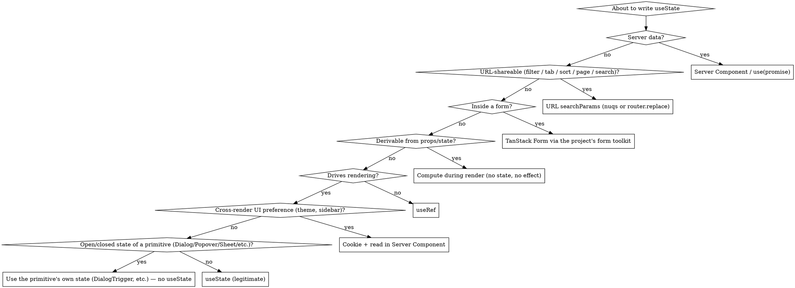

# Next.js 16 `useState` — almost never the right answer

## Scope — Next.js 16 App Router only

This skill applies **only to Next.js 16 App Router projects**. Before applying any rule below, confirm:

- `package.json` has `"next": "^16…"` (or a 16.x range / git ref resolving to 16) **and**
- routes live under `app/` (App Router), not `pages/` (Pages Router).

**If the project is anything else, refuse to apply this skill** and say so explicitly:

- Pages Router — no Server Components, `searchParams` is sync, no `revalidatePath`. Several of the green patterns below don't exist there. Do not apply.
- Next.js 15 or earlier — async `searchParams`, `use(promise)`, and several caching primitives differ. Do not apply.
- Any other framework (Remix, SvelteKit, Astro, Vite + React, plain React, etc.) — the entire "lift to Server Component" branch doesn't transfer. Do not apply.
- Mixed monorepo where some apps are 16/App-Router and some aren't — apply only inside the matching app directory.

State the mismatch plainly ("This file is in `pages/`, so the `nextjs-usestate` skill doesn't apply — Pages Router uses different primitives") and stop.

## Companion skills — install and follow

This skill is the React-state-side complement of three skills you should have installed:

- **`nextjs-data-fetching`** — owns "where does data come from." Most `useState` bugs are *also* data-fetching bugs (server data mirrored into `useState`, filter state in `useState` driving an action refetch). When in doubt, that skill is upstream of this one.
- **`nextjs-forms`** — owns form field state. Every `useState` for an input value belongs there, not here. This skill defers to it for anything inside a `<form>`.
- **`no-use-effect`** — owns the React-side "don't reach for `useEffect`" rule. Many `useState` anti-patterns (derived state, mirroring props, "has mounted" guards) are also `useEffect` anti-patterns. The two skills agree by design.

If a green example here looks like it would have been `useState` + `useEffect` in older code, that's the point — it isn't anymore. Red blocks may show `useState` + `useEffect` only because that's what the anti-pattern looks like in the wild; never copy from a red block.

## The Rule

**`useState` is for ephemeral, local, view-only UI state that no other tab, user, refresh, server render, or design-system primitive would ever care about.**

If the value belongs in any of these places, `useState` is wrong:

- **The URL** — anything someone might link to, bookmark, share, refresh, or hit "back" on (filters, tabs, sort, search, pagination, ranges, selected row in a list view).
- **The server** — data fetched from your DB, an API, or a Server Action result.
- **Props** — values passed from the parent. Don't mirror them; use them.
- **A form library** — field values, dirty/valid/submitting flags, error messages.
- **A `ref`** — values that don't drive rendering (timers, the latest callback, instance handles).
- **A computation** — anything you can derive from props or state during render.
- **A cookie** — cross-render, cross-tab, SSR-visible UI preferences (theme, locale, sidebar-collapsed, last view).
- **The design system** — `Dialog`, `Sheet`, `Popover`, `DropdownMenu`, `Tooltip`, `Collapsible`, `Tabs`, `Select`, `Combobox`, `HoverCard`, `Accordion` (and every uncontrolled equivalent in Radix / Base UI / shadcn) own their own open/closed/active state. **You do not need `useState` for any of it** unless you have a specific cross-component reason to lift it.

What's left for `useState` after that list is genuinely small. That's the point.

**Violating the letter of this rule is violating the spirit.** Every "but I just need a tiny bit of state" is the on-ramp to the patterns below: a page newly converted to `"use client"`, a filter UI that re-POSTs on every chip click, a form that desyncs from the server, a controlled `Dialog` whose only job is to mirror what `DialogTrigger` already does. The bug is silent — no error, no warning, just worse UX, more re-renders, broken back button, broken refresh, broken streaming, broken SSR. **The absence of a stack trace is not the absence of a problem.**

## Why

`useState` is not free in an App Router app. Every `useState` you add:

- Forces the component (and possibly the page) to be `"use client"`, which costs SSR, streaming, request deduping, the React `cache()`, and a bigger client bundle.
- Creates a **second source of truth** for a value that already lives somewhere authoritative (URL, server, props, form state, design-system primitive). Two sources of truth desync; the bug surface is "user reported it's stale after X."
- Loses on **refresh** and **share** — anything in `useState` evaporates the moment the user reloads or sends the URL to a colleague.
- Pulls you toward `useEffect` to reconcile it with the real source of truth, which pulls you toward race conditions, double-fetches, and the entire Pandora's box that `no-use-effect` exists to close.

`useState` is the right call when *none* of those concerns apply — and that's a much smaller set of cases than the average codebase assumes.

## Forbidden: client-side global state libraries

**Do not introduce Zustand, Jotai, Redux, Redux Toolkit, Recoil, Valtio, MobX, XState (as a global store), or any other client-side global state library into a Next.js 16 App Router project. Do not suggest them. Do not migrate to them. Do not "just add a small store for this one thing."**

Every problem these libraries solve in a classic SPA is solved better by an App Router primitive:

| You'd reach for a global store because… | Use this instead |
|---|---|
| "Multiple components need the same server data" | Server Components — the data is already on the server, render it where it's needed. |
| "Multiple components need the same filter / view state" | URL `searchParams` — every component reads from `useSearchParams()` or from the page's `searchParams` prop. |
| "I need cross-page state (theme, sidebar, current org)" | Cookie + Server Component — read it wherever you need it, no provider, no hydration. |
| "I need optimistic UI updates" | `useOptimistic`. |
| "I need form state shared across steps" | TanStack Form via the project's form toolkit — see `nextjs-forms`. |
| "I need to cache server data on the client" | You don't, in 95% of cases. For the 5% that genuinely poll or refetch on focus, see `nextjs-data-fetching` pattern 4 (Route Handler + SWR / React Query). |
| "I need a global event bus / pub-sub" | `useSyncExternalStore` against a module-level subscription, or just lift state to the nearest common parent. |

A global store in an App Router app is **always** a worse answer than the right primitive, because:

- It forces every consumer to be `"use client"`, defeating the point of Server Components.
- It needs a `<Provider>` in `app/layout.tsx`, which makes the entire layout a Client Component (or forces an awkward client-only sub-tree).
- It re-implements URL/server/cookie state on the client, so you now have *two* sources of truth — and the global store will desync from the server on every navigation, every revalidation, every session refresh.
- It survives nothing the user expects: not refresh (gone unless you also wired persistence — which is what cookies are for), not "open in a new tab" (each tab gets its own store), not "send this URL to a colleague" (the store isn't in the URL).
- It hides the actual data flow behind action creators / atoms / selectors, making it impossible to reason about what's a server read, what's a mutation, and what should `revalidatePath`.

**There is no "but my use case is special" exception.** The exceptions people imagine ("I need cross-component state that isn't URL-shareable and isn't server data") almost always resolve to: lift to the nearest common parent, use the URL anyway, use a cookie, use `useSyncExternalStore` for browser-only sources (media query, online status, page visibility). If after walking that list you genuinely have a use case that needs global client state — stop and ask the user before introducing a library. The bar is "I can articulate why URL + cookie + Server Component + lifted local state cannot work," not "this would be more convenient."

If a library is already in the project: the migration is **out**, not deeper. Don't add new stores. Move existing stores to URL / cookies / Server Components one slice at a time.

## Decision: do you actually need `useState`?



**The branches are not peers.** In a typical App Router page, the `useState` (legitimate) leaf fires for maybe 5–10% of the cases that *feel* like state. Every other arrow is the right one most of the time. If you reach `useState (legitimate)` quickly, walk back up — you probably skipped a rung.

## When `useState` IS legitimate

After ruling out everything above, what's left for `useState` is short. The common cases:

- **Truly transient UI state with no design-system primitive that owns it**: drag-in-progress position, the current step in a custom multi-step wizard you built by hand (and that doesn't belong in the URL), a "show all" toggle on a long list that nobody would ever link to.
- **Animation / transition flags** that exist only between two render frames (e.g. `hasEntered`, `isFlashing`) and that no other component needs to observe.
- **Controlled inputs that don't submit anywhere** — a search-as-you-type textbox whose state only filters a client-side list (and even then, ask: should this be `?q=` in the URL?).
- **Lifting design-system state on purpose** — you genuinely need to control a `Dialog` from outside (e.g., open it from a toast, or from a parent action). Then `const [open, setOpen] = useState(false)` + `<Dialog open={open} onOpenChange={setOpen}>` is correct. **But the default is uncontrolled.** Don't lift unless you're doing something the uncontrolled API can't do.

If your `useState` is none of the above, walk back up the decision graph.

## Anti-pattern catalog — red ❌ → green ✅

Each pair is a real failure mode. Cross-references to companion skills are noted where the rule originates elsewhere.

### 1. Filter / tab / sort / search / pagination state in `useState`

❌ **Red — page becomes `"use client"` to host the filter; the URL doesn't reflect the view; refresh and back-button are broken; the server can't pre-render the right data:**

```tsx
"use client";
import { useState } from "react";

export default function CasesPage() {
  const [status, setStatus] = useState<"open" | "closed">("open");
  const [page, setPage] = useState(1);
  // …fetches via useEffect or Server Action, also wrong
  return /* filters + table */;
}
```

✅ **Green — state lives in the URL `searchParams`; the page stays a Server Component; refresh, share, and back-button all work; the server pre-renders the correct data:**

```tsx
// app/(platform)/cases/page.tsx — Server Component
import { listCases } from "@/lib/services/case.service";
import { CasesFilters } from "./cases-filters";

export default async function CasesPage({
  searchParams,
}: {
  searchParams: Promise<{ status?: string; page?: string }>;
}) {
  const { status = "open", page = "1" } = await searchParams;
  const cases = await listCases({ status, page: Number(page) });
  return (
    <>
      <CasesFilters value={status} />
      <CasesTable cases={cases} />
    </>
  );
}
```

```tsx
// cases-filters.tsx — small Client Component, pushes to URL
"use client";
import { usePathname, useRouter, useSearchParams } from "next/navigation";

export function CasesFilters({ value }: { value: string }) {
  const router = useRouter();
  const pathname = usePathname();
  const sp = useSearchParams();
  const set = (status: string) => {
    const next = new URLSearchParams(sp);
    next.set("status", status);
    next.delete("page"); // reset pagination on filter change
    router.replace(`${pathname}?${next}`, { scroll: false });
  };
  return /* chips that call set(...) */;
}
```

For non-trivial URL state (typed params, arrays, defaults, debouncing), prefer **`nuqs`** over hand-rolled `URLSearchParams` — it gives you `useQueryState`/`useQueryStates` with full type-safety and clean defaults, and it round-trips cleanly with Server Components.

#### 1a. Search-as-you-type bound to URL state

Chips and tabs push to the URL once per click — fine. A **text input** that pushes on every keystroke is not. Each `router.replace` re-renders the page (and on a Server Component page, refetches data on the server), which lands back in the input as a controlled-value update. On a slow page that's visible jank: the cursor stutters, characters arrive late, IME composition breaks.

❌ **Red — controlled input bound directly to `?q=`; every keystroke triggers a navigation, every navigation re-renders the input, the input lags behind typing:**

```tsx
"use client";
import { useRouter, useSearchParams, usePathname } from "next/navigation";
import { Input } from "@/components/ui/input";

export function CasesSearch() {
  const router = useRouter();
  const pathname = usePathname();
  const sp = useSearchParams();
  const query = sp.get("q") ?? "";
  return (
    <Input
      value={query}
      onChange={(e) => {
        const next = new URLSearchParams(sp);
        if (e.target.value) next.set("q", e.target.value);
        else next.delete("q");
        router.replace(`${pathname}?${next}`, { scroll: false });
      }}
    />
  );
}
```

✅ **Green — uncontrolled input, frozen `defaultValue`, debounced `router.replace` wrapped in `startTransition`. Typing is local DOM only; the URL catches up after the user pauses; the navigation never blocks input:**

```tsx
"use client";
import { useRef, useTransition } from "react";
import { useRouter, useSearchParams, usePathname } from "next/navigation";
import { Input } from "@/components/ui/input";

export function CasesSearch() {
  const router = useRouter();
  const pathname = usePathname();
  const sp = useSearchParams();
  const query = sp.get("q") ?? "";

  const initialQueryRef = useRef(query);
  const debounceRef = useRef<ReturnType<typeof setTimeout> | null>(null);
  const [, startTransition] = useTransition();

  const setQuery = (next: string) => {
    if (debounceRef.current) clearTimeout(debounceRef.current);
    debounceRef.current = setTimeout(() => {
      const params = new URLSearchParams(sp);
      if (next) params.set("q", next);
      else params.delete("q");
      const qs = params.toString();
      startTransition(() => {
        router.replace(qs ? `${pathname}?${qs}` : pathname, { scroll: false });
      });
    }, 200);
  };

  return (
    <Input
      key={pathname}
      defaultValue={initialQueryRef.current}
      onChange={(e) => setQuery(e.target.value)}
    />
  );
}
```

Three details that all matter:

1. **`defaultValue={initialQueryRef.current}`, not `defaultValue={query}`.** Uncontrolled inputs read `defaultValue` once on mount; passing the live URL value re-initializes it on every URL change and React (and Base UI / Radix `FieldControl`) will warn: *"A component is changing the default value state of an uncontrolled FieldControl after being initialized."* Freezing the initial value in a ref keeps `defaultValue` referentially stable for the lifetime of the input.
2. **`key={pathname}` on the input.** When the user navigates to a different route (or any other identity change you want to reset on), the key changes, the input remounts, and the ref captures a fresh initial value. This is React's built-in "reset state on identity change" mechanism — see Pattern 6.
3. **`startTransition` around `router.replace`.** Marks the navigation as non-urgent so the input keeps responding even if the Server Component re-render is slow.

The local filter list (if any) should still read from the URL (`useSearchParams().get("q")`), optionally through `useDeferredValue`, so the *displayed* results are the source of truth — only the *input field* is uncontrolled. **Do not** mirror the URL value into a `useState` "to keep the input snappy" — that's the controlled-input anti-pattern wearing a different hat, and now you have two sources of truth.

`nuqs` `useQueryState({ throttleMs })` does the debounce part for you, but the uncontrolled-input + frozen-`defaultValue` + `key` combination still applies — `throttleMs` only smooths the URL writes, not the controlled-value re-render.

> Cross-reference: see `nextjs-data-fetching` anti-patterns #2 and #8. The same rule from a different angle.

---

### 2. Server data mirrored into `useState`

❌ **Red — fetch on the client, store in `useState`, lose SSR, lose streaming, ship a loading spinner the user shouldn't see:**

```tsx
"use client";
import { useEffect, useState } from "react";

export default function CasesPage() {
  const [cases, setCases] = useState<Case[] | null>(null);
  useEffect(() => {
    fetch("/api/cases").then((r) => r.json()).then(setCases);
  }, []);
  if (!cases) return <Spinner />;
  return <CasesTable cases={cases} />;
}
```

✅ **Green — fetch on the server, render on the server, no client state at all:**

```tsx
// app/(platform)/cases/page.tsx — Server Component
import { listCases } from "@/lib/services/case.service";

export default async function CasesPage() {
  const cases = await listCases();
  return <CasesTable cases={cases} />;
}
```

If a Client Component genuinely needs the data at mount (interactive chart, third-party widget), pass `Promise<T>` from the parent Server Component and consume with `use()` + `<Suspense>` — still no `useState`.

> Cross-reference: see `nextjs-data-fetching` anti-patterns #1 and #5.

---

### 3. Form field values in `useState`

❌ **Red — every input has its own `useState`; dirty tracking, validation, submit-disabled, and error mapping are all hand-rolled differently in every form:**

```tsx
"use client";
import { useState } from "react";

export function EditCaseForm({ initial }: { initial: Case }) {
  const [title, setTitle] = useState(initial.title);
  const [notes, setNotes] = useState(initial.notes);
  const [submitting, setSubmitting] = useState(false);
  const [error, setError] = useState<string | null>(null);
  const dirty = title !== initial.title || notes !== initial.notes;
  /* …onSubmit, validation, toast, 422 mapping, all by hand */
}
```

✅ **Green — go through the project's form toolkit (TanStack Form + Zod + shadcn `Field`); `useEditForm` owns dirty/valid/submitting/error mapping/toast once:**

```tsx
"use client";
import { useEditForm } from "@/lib/forms/use-edit-form";
import { CaseSchema } from "@/lib/forms/schemas/case";
import { updateCaseAction } from "@/lib/actions/cases.actions";

export function EditCaseForm({ initial }: { initial: Case }) {
  const form = useEditForm({
    initial,
    schema: CaseSchema,
    action: updateCaseAction,
  });
  return /* form.Field + form.Subscribe + Save button gated by dirty + valid */;
}
```

> Cross-reference: see `nextjs-forms`. Every input value, dirty flag, valid flag, submitting flag, and error message in a form belongs there — not in `useState`.

---

### 4. Optimistic UI built with `useState` + manual rollback

❌ **Red — keep the "real" list in `useState`, prepend the new item, then re-fetch and replace it — easy to desync, easy to lose items if the request fails between the two updates:**

```tsx
"use client";
import { useState } from "react";

export function Thread({ initial }: { initial: Message[] }) {
  const [msgs, setMsgs] = useState(initial);
  async function onSend(text: string) {
    setMsgs((m) => [...m, { text, pending: true }]);
    await sendMessage(text);
    setMsgs(await listMessages()); // also a data-fetching anti-pattern
  }
  /* … */
}
```

✅ **Green — `useOptimistic`; the action mutates and `revalidatePath`s, the optimistic value bridges the gap, the source of truth never moves to the client:**

```tsx
"use client";
import { useOptimistic } from "react";
import { sendMessage } from "@/lib/actions/chat.actions";

export function Thread({ messages }: { messages: Message[] }) {
  const [optimistic, addOptimistic] = useOptimistic<Message[], string>(
    messages,
    (state, text) => [...state, { text, pending: true }],
  );
  async function formAction(formData: FormData) {
    const text = formData.get("text") as string;
    addOptimistic(text);
    await sendMessage(text);
  }
  return (
    <>
      {optimistic.map((m, i) => <div key={i}>{m.text}</div>)}
      <form action={formAction}>{/* … */}</form>
    </>
  );
}
```

> Cross-reference: see `nextjs-data-fetching` anti-pattern #6.

---

### 5. Derived state in `useState` + `useEffect`

❌ **Red — store a value in `useState` that you can compute from other state/props; use `useEffect` to keep it in sync; pay an extra render and a bug surface:**

```tsx
"use client";
import { useEffect, useState } from "react";

export function NameBadge({ first, last }: { first: string; last: string }) {
  const [full, setFull] = useState(`${first} ${last}`);
  useEffect(() => {
    setFull(`${first} ${last}`); // runs after every render where first/last changed
  }, [first, last]);
  return <span>{full}</span>;
}
```

✅ **Green — compute during render. No state, no effect, no extra render, no bug:**

```tsx
"use client";

export function NameBadge({ first, last }: { first: string; last: string }) {
  const full = `${first} ${last}`;
  return <span>{full}</span>;
}
```

For expensive derivations only, wrap with `useMemo` — but only after measuring. The default is "just compute it." Cheap math, string concatenation, array `.filter`/`.map` over hundreds of items: **don't memoize, don't store, don't effect — just compute.**

> Cross-reference: see `no-use-effect` — derived state is its first replacement pattern.

---

### 6. Mirroring props into `useState`

❌ **Red — copy a prop into `useState`; the moment the parent passes a new value, your local copy is stale; reach for `useEffect` to sync; ship a bug:**

```tsx
"use client";
import { useState } from "react";

export function CaseDetailPanel({ caseRecord }: { caseRecord: Case }) {
  const [title, setTitle] = useState(caseRecord.title);
  // when parent re-renders with a different caseRecord, `title` doesn't update
  return <h2>{title}</h2>;
}
```

✅ **Green — read the prop. If you genuinely need a *fresh* local copy whenever the parent's identity changes (e.g., resetting an editing buffer when the user picks a different record), use the `key` prop on the component to remount it:**

```tsx
// Parent
<CaseDetailPanel key={caseRecord.id} caseRecord={caseRecord} />
```

```tsx
// Child — local edit buffer is now correctly fresh per `caseRecord.id`
"use client";
import { useState } from "react";

export function CaseDetailPanel({ caseRecord }: { caseRecord: Case }) {
  const [draftTitle, setDraftTitle] = useState(caseRecord.title);
  /* …uses draftTitle for an unsaved edit buffer */
}
```

The key prop is React's built-in "reset state when this identity changes" mechanism. It is the correct tool — not `useEffect(() => setDraftTitle(caseRecord.title), [caseRecord.id])`.

---

### 7. Cross-render UI preferences (theme, sidebar collapsed, last view) in `useState`

❌ **Red — store the user's theme preference in `useState`; sync to `localStorage` in a `useEffect`; ship a flash of the wrong theme on first paint; lose SSR correctness:**

```tsx
"use client";
import { useEffect, useState } from "react";

export function ThemeToggle() {
  const [theme, setTheme] = useState<"light" | "dark">("light");
  useEffect(() => {
    setTheme((localStorage.getItem("theme") as any) ?? "light");
  }, []);
  /* …flash of light theme on dark-mode users every page load */
}
```

✅ **Green — store the preference in a cookie; read it in the Server Component; render the correct theme on first paint with no flash and no client state:**

```ts
// lib/theme.ts
"use server";
import { cookies } from "next/headers";

export async function setTheme(theme: "light" | "dark") {
  (await cookies()).set("theme", theme, { path: "/", maxAge: 60 * 60 * 24 * 365 });
}
```

```tsx
// app/layout.tsx — Server Component
import { cookies } from "next/headers";

export default async function RootLayout({ children }: { children: React.ReactNode }) {
  const theme = (await cookies()).get("theme")?.value ?? "light";
  return (
    <html data-theme={theme} className={theme === "dark" ? "dark" : undefined}>
      <body>{children}</body>
    </html>
  );
}
```

```tsx
// theme-toggle.tsx — small Client Component, no useState
"use client";
import { setTheme } from "@/lib/theme";
import { useTransition } from "react";

export function ThemeToggle({ current }: { current: "light" | "dark" }) {
  const [pending, start] = useTransition();
  return (
    <button
      disabled={pending}
      onClick={() => start(() => setTheme(current === "dark" ? "light" : "dark"))}
    >
      {current === "dark" ? "Light" : "Dark"} mode
    </button>
  );
}
```

Same pattern for: sidebar collapsed, locale, density, "last selected tab on this dashboard," any other cross-render preference. The cookie is read by the Server Component on every navigation; no client state, no `localStorage` flash, no `useEffect`.

For libraries: `next-themes` does exactly this for theme; if you adopt it, follow its docs — but the default for any *other* preference of this shape is "cookie + Server Component," not `useState` + `localStorage`.

---

### 8. Non-render values in `useState`

❌ **Red — store a `setInterval` handle, a "previous value," or a "latest callback" in `useState`; trigger an unnecessary re-render every time you update it:**

```tsx
"use client";
import { useEffect, useState } from "react";

export function Ticker() {
  const [intervalId, setIntervalId] = useState<NodeJS.Timeout | null>(null);
  useEffect(() => {
    const id = setInterval(/* … */, 1000);
    setIntervalId(id); // forces a re-render for no reason
    return () => clearInterval(id);
  }, []);
  /* … */
}
```

✅ **Green — `useRef`. The value persists across renders, mutating it doesn't trigger a re-render, and the type is honest about the fact that it's a mutable handle, not state:**

```tsx
"use client";
import { useEffect, useRef } from "react";

export function Ticker() {
  const intervalRef = useRef<NodeJS.Timeout | null>(null);
  useEffect(() => {
    intervalRef.current = setInterval(/* … */, 1000);
    return () => {
      if (intervalRef.current) clearInterval(intervalRef.current);
    };
  }, []);
  /* … */
}
```

**Rule of thumb:** if you don't read the value during render, it is not state. Use a ref.

---

### 9. "Constants" or computed-once values in `useState`

❌ **Red — `useState` for a value that never changes; code reviewer reads "state" and assumes it's mutable:**

```tsx
"use client";
import { useState } from "react";

export function Form() {
  const [statuses] = useState(["open", "in-progress", "closed"]);
  const [maxAttachments] = useState(10);
  /* … */
}
```

✅ **Green — module-level `const` (or `useMemo` only if you genuinely need referential stability per-render of an expensive computation):**

```tsx
"use client";

const STATUSES = ["open", "in-progress", "closed"] as const;
const MAX_ATTACHMENTS = 10;

export function Form() {
  /* … */
}
```

`useState` for a constant is a smell that suggests "I once thought this might change, then it didn't, and I forgot to clean up." Clean it up.

---

### 10. Multiple `useState`s that always change together

❌ **Red — five `useState`s for one logical thing; updates must come in matched pairs; one missed update = inconsistent UI:**

```tsx
"use client";
import { useState } from "react";

export function Wizard() {
  const [step, setStep] = useState(0);
  const [name, setName] = useState("");
  const [email, setEmail] = useState("");
  const [errors, setErrors] = useState<Record<string, string>>({});
  const [submitting, setSubmitting] = useState(false);
  /* every transition has to remember to update 3+ of these together */
}
```

✅ **Green — first ask "is this a form?" If yes, go to `nextjs-forms`. If it's genuinely a non-form state machine, use `useReducer` so transitions are atomic and named:**

```tsx
"use client";
import { useReducer } from "react";

type State = { step: number; data: { name: string; email: string }; errors: Record<string, string>; submitting: boolean };
type Action =
  | { type: "next"; data: Partial<State["data"]> }
  | { type: "back" }
  | { type: "submit-start" }
  | { type: "submit-error"; errors: State["errors"] };

function reducer(state: State, action: Action): State {
  switch (action.type) {
    case "next":         return { ...state, step: state.step + 1, data: { ...state.data, ...action.data }, errors: {} };
    case "back":         return { ...state, step: Math.max(0, state.step - 1) };
    case "submit-start": return { ...state, submitting: true, errors: {} };
    case "submit-error": return { ...state, submitting: false, errors: action.errors };
  }
}
```

If the state machine is a form, this is the wrong file — go use `useEditForm` / `useCreateForm`.

---

### 11. Page or layout converted to `"use client"` to host one piece of state

❌ **Red — entire page becomes a Client Component to enable a single `useState`; the page loses SSR, streaming, async data fetching, and the ability to live alongside Server Components:**

```tsx
"use client"; // entire page is now a Client Component
import { useState } from "react";

export default function CasesPage() {
  const [tab, setTab] = useState("open");
  /* …everything below now runs on the client */
}
```

✅ **Green — keep the page as a Server Component; isolate the interactive bit in the smallest possible Client leaf; if the state is shareable, push it to the URL (anti-pattern #1):**

```tsx
// app/(platform)/cases/page.tsx — Server Component
import { listCases } from "@/lib/services/case.service";
import { TabBar } from "./tab-bar"; // "use client" — pushes ?tab=… to URL

export default async function CasesPage({
  searchParams,
}: { searchParams: Promise<{ tab?: string }> }) {
  const { tab = "open" } = await searchParams;
  const cases = await listCases({ tab });
  return (
    <>
      <TabBar value={tab} />
      <CasesTable cases={cases} />
    </>
  );
}
```

The default for every new page should be Server Component. Add `"use client"` to the smallest leaf that needs interactivity, never to the page itself.

> Cross-reference: see `nextjs-data-fetching` anti-pattern #8.

---

### 12. "Has mounted" / "is on the client" SSR guards in `useState`

❌ **Red — use `useState(false)` + `useEffect(() => setMounted(true), [])` to gate rendering of client-only content; ship a hydration mismatch hack into every component:**

```tsx
"use client";
import { useEffect, useState } from "react";

export function ClientOnlyChart({ data }: { data: number[] }) {
  const [mounted, setMounted] = useState(false);
  useEffect(() => setMounted(true), []);
  if (!mounted) return null;
  return <Chart data={data} />;
}
```

✅ **Green — pick the right primitive for what you actually mean:**

- **"This component reads from `localStorage` / `window` / `navigator` and the server can't"** → `next/dynamic` with `ssr: false`:
  ```tsx
  // parent.tsx (Server or Client Component)
  import dynamic from "next/dynamic";
  const Chart = dynamic(() => import("./chart"), { ssr: false });
  ```
- **"This component subscribes to a browser-only store (theme, online status, media query)"** → `useSyncExternalStore` with a server snapshot:
  ```tsx
  "use client";
  import { useSyncExternalStore } from "react";
  const subscribe = (cb: () => void) => {
    const mq = window.matchMedia("(prefers-color-scheme: dark)");
    mq.addEventListener("change", cb);
    return () => mq.removeEventListener("change", cb);
  };
  export function useDark() {
    return useSyncExternalStore(
      subscribe,
      () => window.matchMedia("(prefers-color-scheme: dark)").matches,
      () => false, // server snapshot
    );
  }
  ```
- **"I genuinely need to run something exactly once after mount"** → the project's `useMountEffect` helper from the `no-use-effect` skill — explicit intent, single eslint-disable in one place. Not `useState` + `useEffect`.

`useState(false)` + `useEffect(() => setState(true), [])` is the wrong shape for every one of these. If you find it in the codebase, classify which of the three it actually wanted to be and replace it.

---

### 13. `useState` for open/closed state the design system already owns

This is the case the user explicitly called out, and it's the most common single source of unnecessary `useState` in a typical Next.js + shadcn project. **Most "is this dialog open" / "is this menu open" / "is this popover open" state is not yours to manage.** The shadcn / Radix / Base UI primitives ship an uncontrolled API that already owns it, and trying to mirror it in `useState` either breaks the primitive's behavior or duplicates state for no benefit.

❌ **Red — controlling every shadcn primitive by hand. Every dialog, sheet, popover, dropdown, tooltip, and accordion grows its own `useState` + handlers. None of it adds anything the uncontrolled API didn't already do:**

```tsx
"use client";
import { useState } from "react";
import { Dialog, DialogContent, DialogTrigger } from "@/components/ui/dialog";
import { Button } from "@/components/ui/button";

export function ArchiveCaseDialog({ id }: { id: string }) {
  const [open, setOpen] = useState(false);
  return (
    <Dialog open={open} onOpenChange={setOpen}>
      <DialogTrigger asChild>
        <Button onClick={() => setOpen(true)} variant="outline">Archive</Button>
      </DialogTrigger>
      <DialogContent>
        {/* …confirm / cancel buttons that all call setOpen(false) by hand */}
      </DialogContent>
    </Dialog>
  );
}
```

✅ **Green — uncontrolled. `DialogTrigger` opens the dialog; clicking the overlay, pressing Escape, or rendering a `DialogClose` inside closes it. Zero `useState`, zero handlers, zero bugs:**

```tsx
"use client";
import { Dialog, DialogClose, DialogContent, DialogTrigger } from "@/components/ui/dialog";
import { Button } from "@/components/ui/button";

export function ArchiveCaseDialog({ id }: { id: string }) {
  return (
    <Dialog>
      <DialogTrigger asChild>
        <Button variant="outline">Archive</Button>
      </DialogTrigger>
      <DialogContent>
        {/* confirm action — when it succeeds, wrap the trigger in <DialogClose> */}
        <DialogClose asChild>
          <Button onClick={() => archiveCaseAction(id)}>Confirm</Button>
        </DialogClose>
      </DialogContent>
    </Dialog>
  );
}
```

The same applies to (non-exhaustive):

| Primitive | Uncontrolled close mechanism |
|---|---|
| `Dialog`, `AlertDialog` | `DialogClose` / `AlertDialogCancel` / `AlertDialogAction`, Escape, overlay click |
| `Sheet` | `SheetClose`, Escape, overlay click |
| `Popover`, `HoverCard` | Outside click, Escape |
| `DropdownMenu`, `ContextMenu`, `Menubar` | Item selection, Escape, outside click |
| `Tooltip` | Pointer leave, focus loss |
| `Collapsible`, `Accordion` | `CollapsibleTrigger` / `AccordionTrigger` toggles itself |
| `Tabs` | `TabsTrigger` sets the active tab via `defaultValue` |
| `Select`, `Combobox` | `SelectTrigger` / Combobox input handle their own open state |
| `Toast` (sonner) | Auto-dismiss, action button, swipe-to-dismiss |

**You only need `useState` + the controlled API when one of these is true:**

1. **Programmatic open from a non-trigger source** — opening a dialog from a toast action, from a global event, from a parent component that doesn't render the trigger, or from a router event.
2. **Conditional close based on async work** — keeping the dialog open while a mutation is in-flight, then closing it on success and showing an error in-place on failure (and even then, often `<form action={...}>` + `useFormStatus` + `DialogClose` on success is cleaner than manual `setOpen`).
3. **State the primitive doesn't expose** — e.g., resetting an internal step counter when the dialog opens; that lives in a child of `<DialogContent>` keyed on the open state, not in the open boolean itself.
4. **Coordinated open across multiple primitives** — e.g., a wizard that flows from `Dialog` → `Sheet` → `Dialog`. Rare. If you build one of these, the controlled state usually belongs in a parent reducer, not in scattered `useState`s.

If none of the above apply — and for the vast majority of dialogs, sheets, popovers, dropdowns, and tooltips in a typical app, none do — **delete the `useState`, delete the `onOpenChange`, delete the `onClick={() => setOpen(true)}`, and let the primitive do its job.**

> Same logic applies to Radix UI directly and to Base UI — both ship uncontrolled APIs for every overlay primitive. shadcn just re-exports them.

## Quick reference

| You want to track… | Use |
|---|---|
| Filter / tab / sort / search / pagination / range | URL `searchParams` (router.replace or `nuqs`) |
| Server data | Server Component / `use(promise)` + `<Suspense>` |
| Form field values, dirty, valid, submitting, errors | TanStack Form via the project's form toolkit |
| Optimistic UI during a mutation | `useOptimistic` |
| Derived value (computable from props/state) | Compute during render; `useMemo` only if expensive AND measured |
| Local copy of a prop that should reset on identity change | Use the prop, or `key` on the component to remount |
| Theme / locale / sidebar collapsed / cross-render UI preference | Cookie + Server Component (or `next-themes` for theme specifically) |
| Mutable value that doesn't drive rendering (timer handle, latest callback) | `useRef` |
| Constant / never changes | Module-level `const` |
| Several values that always change together | `useReducer` (or `nextjs-forms` if it's a form) |
| Open/closed state of a `Dialog` / `Sheet` / `Popover` / `DropdownMenu` / `Tooltip` / `Collapsible` / `Tabs` / `Select` / `Accordion` | The primitive's uncontrolled API — **no `useState` at all** |
| "Has mounted" / "is on the client" guard | `next/dynamic({ ssr: false })`, `useSyncExternalStore`, or `useMountEffect` |
| Genuinely transient local UI state with no other home | `useState` (legitimate) |

## Red flags — STOP and switch pattern

If you catch yourself writing or approving any of these, stop:

- `useState` for filter / tab / sort / search / pagination state.
- `useState` + `useEffect(fetch).then(setX)` to load data.
- `useState` for any input that lives inside a `<form>`.
- `useState` initialized from a prop (`useState(props.x)`) without a `key` strategy.
- `useState` + `useEffect(() => setX(deriveFrom(props)), [props.y])` — that's derived state.
- `useState` whose only update path is "syncing with a prop or with `localStorage`."
- `useState<Theme>` / `useState<Locale>` / `useState<"collapsed" | "expanded">` for sidebar — anything that should survive a refresh.
- `useState<NodeJS.Timeout>` / `useState<MutableHandle>` / `useState<Subscription>` — that's a ref.
- `useState(CONSTANT_ARRAY)` / `useState(CONSTANT_NUMBER)` — that's a `const`.
- A page, layout, or template whose top-level `"use client"` exists only to host a `useState`.
- `const [open, setOpen] = useState(false)` next to a shadcn / Radix / Base UI primitive, without a specific reason that the uncontrolled API can't handle.
- `useState(false)` + `useEffect(() => setMounted(true), [])` — wrong shape for whatever you actually meant.
- Five `useState`s in one component that always update in lockstep.
- "I'll just useState it for now and refactor later" — you won't.
- **Any import from `zustand`, `jotai`, `redux`, `@reduxjs/toolkit`, `react-redux`, `recoil`, `valtio`, or `mobx` / `mobx-react`.** These libraries are forbidden in this project — see the "Forbidden" section above. If you find one in a diff, block the PR.
- A `<Provider>` wrapping `app/layout.tsx`'s `children` whose only job is to host a client-side global store — same rule, same block.

## Common rationalizations and the honest answer

These are the exact excuses observed under deadline pressure. Every one is wrong here.

| Excuse | Reality |
|---|---|
| "It's just a tiny bit of state, useState is fine." | Tiny bits compound. The page is now `"use client"`, the URL doesn't reflect the view, refresh breaks the UX, and the next dev adds three more `useState`s next to yours. The first one is the cheapest moment to put it in the right place. |
| "URL searchParams are awkward / I don't want them in the URL." | Use the URL anyway. Shareable, bookmarkable, back-button works, no client/server divergence, free Server Component re-render. The "ugliness" is a smaller cost than every alternative. Use `nuqs` if the syntax bothers you. |
| "I need it client-side for interactivity." | Interactivity ≠ client-side state. Put filter state in URL `searchParams`; the Client Component pushes via `router.replace` and the Server Component re-renders. Open/closed state goes in the design-system primitive's own state. Form values go in TanStack Form. The set of state that *actually* belongs in `useState` is small. |
| "It works in dev." | Many of these bugs are silent: stale local copies of props, lost data on refresh, hydration mismatches that React papers over, double-renders no one measured. Absence of an error is not a green light. |
| "useState is React, I'm just using React." | You're using React inside Next.js 16 App Router. That has primitives older React patterns don't: Server Components, `searchParams`, `useOptimistic`, `useFormStatus`, cookies in Server Components, `revalidatePath`, the design system's uncontrolled overlay primitives. Pretending those don't exist is how the anti-patterns happen. |
| "Other code in this project does it this way." | Other code is wrong. Don't propagate it. Add a TODO if you don't have time to refactor right now, but don't start a new file with the same anti-pattern. |
| "I need to control the dialog because eventually I'll want to open it programmatically." | "Eventually" is YAGNI. When you actually need programmatic open, lift to controlled then. Until then, uncontrolled is fewer lines, fewer bugs, and trivially convertible. |
| "I'll just useState it and sync with useEffect." | That's the canonical anti-pattern. If you find yourself reaching for `useEffect` to keep `useState` in sync with anything else, you picked the wrong primitive — derive, use the prop, use the URL, use the cookie, use the form library. |
| "The senior dev / the tutorial does it this way." | Many tutorials predate App Router or are about Pages Router. Many "senior" patterns predate Server Components and `useOptimistic`. Cite the docs and the companion skills, not the teammate. |
| "useState for my dialog open is the canonical shadcn example." | shadcn's components ship as uncontrolled by default. The controlled examples in their docs exist to *show* the controlled API, not to prescribe it. The "vast majority of dialogs are uncontrolled" rule is from Radix's own docs. |
| "I need a local edit buffer that doesn't immediately overwrite the prop." | Then `useState(initial)` + `key={record.id}` on the parent is correct — the state is genuinely local, and `key` resets it on identity change. Without the `key`, you have a desync bug waiting to happen. |
| "useReducer feels like overkill for three useStates." | Three `useState`s that always update together is exactly the case `useReducer` exists for. The "overkill" feeling is "I've seen useState more often." That's not a technical reason. |
| "Cookies for theme are fancy, useState + localStorage works." | `useState` + `localStorage` flashes the wrong theme on first paint, every time, for every user, on every navigation. The cookie + Server Component pattern eliminates the flash entirely. The "works" claim ignores the part the user sees. |
| "It's not my PR — refactoring is scope creep." | Approving the wrong primitive is approving permanent debt. Block, link this skill, ask for the right version. That's the review's job. |
| "I'll fix it later." | You won't. The PR you're writing now is the cheapest moment to do it right. |
| "Let's add Zustand / Jotai / Redux for this." | No. They are forbidden in this project. See the "Forbidden" section. The need you're feeling is solved by URL `searchParams`, cookies, Server Components, `useOptimistic`, the form toolkit, or lifting state to a common parent — pick one. |
| "Just a tiny Zustand store, it's only 1KB." | The cost isn't the bundle. The cost is that every consumer becomes `"use client"`, the source of truth moves off the server, and the URL stops reflecting the view. The library is the symptom; the architecture is the bug. |
| "Redux is the industry standard." | Not in App Router projects. The "industry standard" predates Server Components, `useOptimistic`, async `searchParams`, and cookies in Server Components. The current standard for this project is the App Router primitives. Forbidden here. |
| "But Zustand works fine with Next.js, the docs even show it." | "Works" ≠ "right." It compiles and runs; it also forces clientification, hides data flow, and desyncs from the server. The library docs show the API, not the architectural cost. Forbidden here. |

## Audit

When the user asks to **audit** a codebase against this skill (phrasings: "audit my codebase against nextjs-usestate", "/audit-usestate", "find useState anti-patterns", "scan for useState misuse"), follow this recipe. Do not modify code during the audit — produce a report only. Offer to fix issues afterwards.

### Step 1 — confirm scope

Run scope checks first; if they fail, abort the audit:

- `package.json` has `"next": "^16…"` (or 16.x range).
- Routes live under `app/`, not `pages/`.

If the project is mixed, narrow the audit to the App Router app(s) and say so in the report.

### Step 2 — scan for the thirteen anti-patterns

Run these greps in parallel from the project root. Each maps to one of the numbered anti-patterns. Use ripgrep where available; fall back to `grep -rn`.

```bash
# 1. Filter / tab / sort / search / pagination state in useState
rg -n --type=tsx --type=ts -e 'useState[^)]*(?:filter|tab|sort|search|page|pagination|range|status|view|mode)' \
  -g '!node_modules' -g '!.next'

# 2. Server data mirrored into useState (heuristic: useState + fetch / .then in same component)
rg -ln --type=tsx --type=ts -e 'useState' \
  -g '!node_modules' -g '!.next' \
  | xargs -I{} rg -l -e 'fetch\(' -e '\.then\(' -e 'await\s+\w+Action\(' {} 2>/dev/null

# 3. Form field values in useState (heuristic: useState near input/onChange/onSubmit, NOT inside the forms toolkit)
rg -n --type=tsx -B2 -A6 -e 'useState' \
  -g '!node_modules' -g '!.next' -g '!lib/forms/**' \
  | rg -B4 -A2 -e 'onChange' -e 'onSubmit' -e '<input' -e '<textarea' -e '<select'

# 4. useState used for optimistic UI without useOptimistic
rg -ln --type=tsx -e 'useState' -g '!node_modules' -g '!.next' \
  | xargs -I{} rg -l -e 'await\s+\w+Action\(' {} 2>/dev/null \
  | xargs -I{} rg -L 'useOptimistic' {} 2>/dev/null

# 5. Derived state — useState whose only update is in a useEffect from props/state
rg -n --type=tsx --type=ts -B2 -A6 -e 'useEffect' \
  -g '!node_modules' -g '!.next' \
  | rg -B4 -A2 -e 'set[A-Z]\w+\(' \
  | rg -v -e 'fetch\(' -e 'subscribe' -e 'addEventListener'

# 6. Mirroring props into useState (heuristic: useState(props.X) or useState(propX))
rg -n --type=tsx --type=ts -e 'useState\(\s*(?:props\.|\w+\s*[,)])' \
  -g '!node_modules' -g '!.next'

# 7. Theme / locale / sidebar / preference state in useState + localStorage
rg -n --type=tsx --type=ts -B2 -A6 -e 'localStorage' \
  -g '!node_modules' -g '!.next' \
  | rg -B4 -A4 -e 'useState'

# 8. Non-render values in useState (heuristic: useState typed with browser/Node handle types)
rg -n --type=tsx --type=ts -e 'useState<.*(?:Timeout|Interval|Subscription|AbortController|MediaQueryList|EventSource|WebSocket)' \
  -g '!node_modules' -g '!.next'

# 9. useState for constants (heuristic: useState with a literal array/object/number that's never reassigned)
rg -n --type=tsx --type=ts -e 'useState\(\s*\[' -e 'useState\(\s*\{' -e 'useState\(\s*\d' \
  -g '!node_modules' -g '!.next'

# 10. Components with 4+ useState declarations (smell — likely should be useReducer or a form)
rg -c --type=tsx --type=ts -e 'useState' \
  -g '!node_modules' -g '!.next' \
  | awk -F: '$2 >= 4 { print }'

# 11. Pages or layouts marked "use client" at the top
rg -ln --type=tsx '^"use client"' app/ \
  | rg -e '/page\.tsx$' -e '/layout\.tsx$' -e '/template\.tsx$'

# 12. "Has mounted" pattern: useState(false) + useEffect that flips it true
rg -n --type=tsx --type=ts -B1 -A6 -e 'useState\(\s*false\s*\)' \
  -g '!node_modules' -g '!.next' \
  | rg -B2 -A4 -e 'useEffect' \
  | rg -B4 -A2 -e 'set\w+\(\s*true\s*\)'

# 13. Controlled overlay primitives (Dialog/Sheet/Popover/etc.) with useState + onOpenChange
rg -n --type=tsx -B2 -A2 -e '<(Dialog|AlertDialog|Sheet|Popover|HoverCard|DropdownMenu|ContextMenu|Menubar|Tooltip|Collapsible|Accordion|Tabs|Select)\b[^>]*\bopen=' \
  -g '!node_modules' -g '!.next'

# FORBIDDEN — any client-side global state library (always a critical finding)
rg -n --type=tsx --type=ts -e "from\s+['\"](zustand|jotai|@reduxjs/toolkit|redux|react-redux|recoil|valtio|mobx|mobx-react|mobx-react-lite)['\"]" \
  -g '!node_modules' -g '!.next'
# Also check package.json:
rg -n -e '"(zustand|jotai|@reduxjs/toolkit|redux|react-redux|recoil|valtio|mobx|mobx-react|mobx-react-lite)"' package.json **/package.json 2>/dev/null
```

For findings, additionally inspect the file: a `useState` that is only ever read in a `<Dialog open={...}>` and only ever written by `setOpen(true)` / `setOpen(false)` is a **Pattern 13** violation regardless of how it's spelled.

### Step 3 — produce the report

Markdown report grouped by anti-pattern (1 through 13). For each finding, include:

- File path and line number (clickable: `path/to/file.tsx:42`).
- A 3–5 line excerpt.
- Which anti-pattern it matches.
- The corresponding fix from the catalog (link to the section heading), in one sentence.
- Severity: **high** (Pattern 1, 2, 3, 7, 11 — direct rule violations with user-visible regressions: broken refresh, wrong theme on first paint, lost SSR), **medium** (Pattern 4, 5, 6, 8, 12, 13 — usually rule violations), **low** (Pattern 9, 10 — heuristic matches that need human eyes).

Sort within each group by severity, then file path.

End the report with a summary table:

| Pattern | High | Medium | Low | Total |
|---|---|---|---|---|

…and a one-paragraph recommendation: which anti-pattern dominates, and which one to tackle first (usually Pattern 1, 11, or 13 — they're the highest-leverage and the easiest to refactor mechanically).

### Step 4 — offer next steps

After delivering the report, offer (do not execute unprompted):

1. **Fix one pattern at a time** — pick the highest-volume pattern, refactor it across the codebase, run tests/typecheck.
2. **Fix one file at a time** — work top-down through the report.
3. **Open a tracking issue** — convert the report to a GitHub issue with a checklist.

Wait for the user to choose before touching code.
